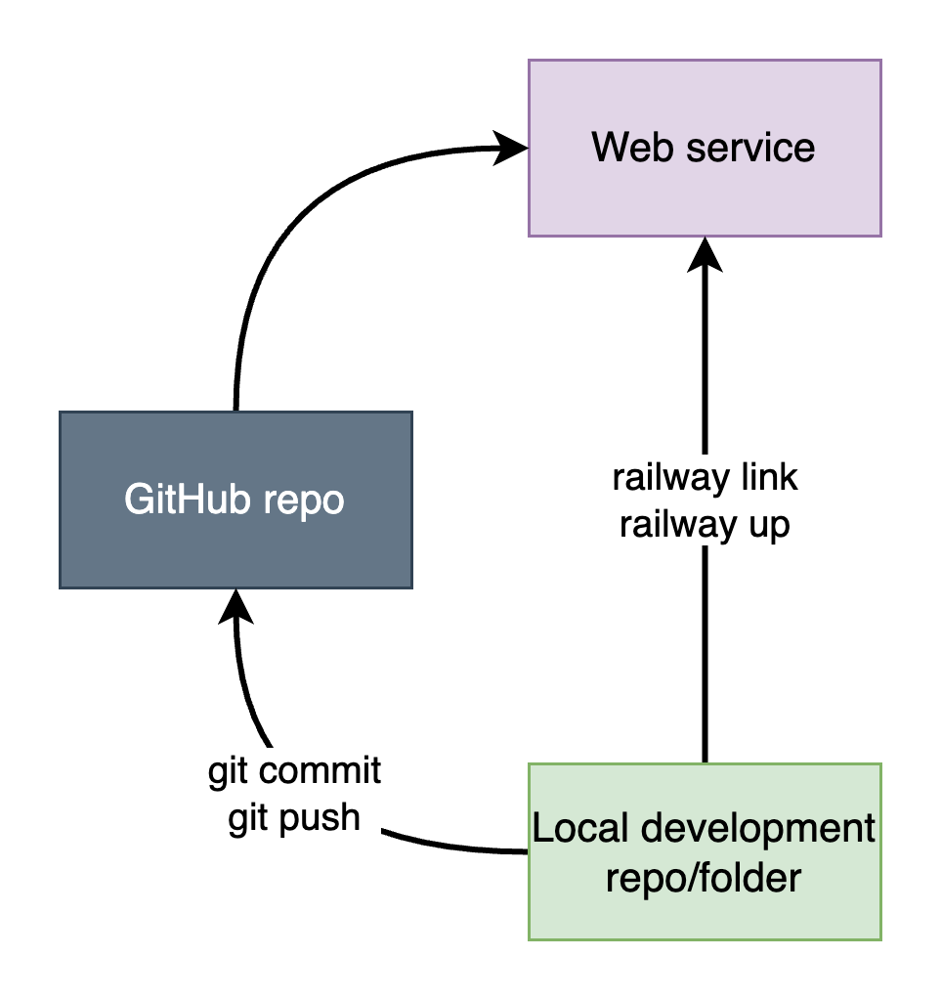

# Pushing our API to Railway

## General and setup
When working with Railway, we want two things:
1. A GitHub repo with code
2. A project in Railway

These two will be connected. We can either deploy from a template (this will create a new GitHub repo) or use an existing GitHub repo.

We can then clone the repo to our computer, work on the code, and "push" it to Railway. There are two ways of pushing our code:
1. `git commit` and `git push` to GitHub
2. `railway up` to Railway

<!--  -->


Importantly, to use the command `railway up`, you will first have to login and link. Try "up", if it does not work, try "link" first. If that does not work, do "login".

```bash
railway login  # Connect to your account
railway link  # Connect to your project
railway up  # Pushing new code to Railway.app
```

You should generally use `railway up` instead of `git commit + push`, for two reasons:
1. It's faster.
2. Making new commits for every debugging you do would be bad practice.


## Init
To set up from a template, choose
1. New project (from template)
1. Choose relevant template. In this case: FastAPI
1. Let it create GitHub repo (can be either public or private)
1. Clone GitHub repo to your computer
1. Update code locally and run the railway command(s) above
1. Wait for building process to be done (and maybe another minute)
1. API (or whatever) is updated from local files :D


## Use our existing API
(Or just copying the template into a new repo)

1. Create new repo (either from GitHub + clone or `git init` and commit+push)
1. Once repo is on GitHub, go to Railway and select:
1. New project (from GitHub repo)
1. Follow instructions
1. Connect local folder to Railway (Same as above: railway link)


## Debugging
Typical issues are:

- Not calling the main Python file `main.py`. This is how Railway knows which file to run.

- Using external modules without including a `requirements.txt` file. This is how Railway knows what modules are necessary.
